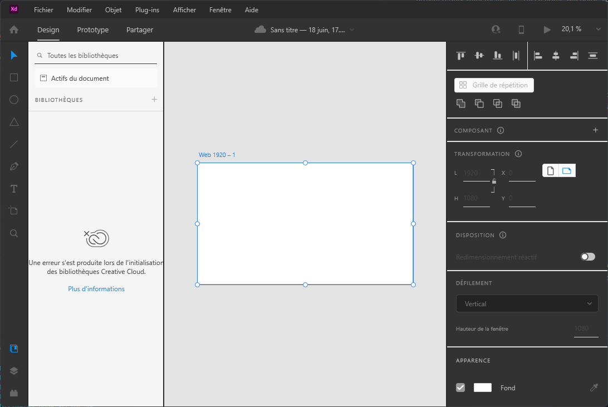
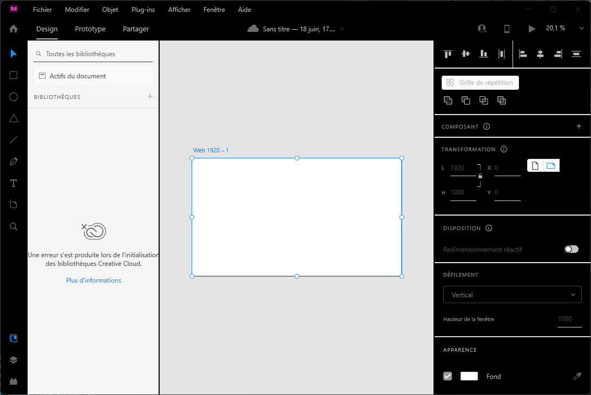

# DarkXDPatcher

DarkXDPatcher is a tool that enables you to apply a dark theme to the General.xaml file in Adobe XD using a provided dark.yaml theme file. This readme will guide you through the necessary steps to install and use DarkXDPatcher effectively.

## Screenshots




## Quick Instructions

1. Obtain and open either the `output.xaml` file or the `outputBlack.xaml` file, depending on your preference for a classic Adobe dark style or a full black version.

2. Grant access to the `C:/WindowsApps/` directory:

   - Right-click on the folder.
   - Select "Properties."
   - Click on the "Security" tab.
   - Choose "Advanced" settings.
   - Click on "Change" next to "Owner."
   - Enter your Windows username (e.g., `lucas`).
   - Click "OK."
   - Click "Apply."

3. Locate the `General.xaml` file that you wish to modify within your Adobe XD installation directory. By default, this file is typically found at `C:/WindowsApps/Adobe.XD_[Random version number]/theme/General.xaml`.

4. Provide access to the `General.xaml` file:

   - Right-click on the folder.
   - Select "Properties."
   - Click on the "Security" tab.
   - Choose "Advanced" settings.
   - Click on "Change" next to "Owner."
   - Enter your Windows username (e.g., `lucas`).
   - Click "OK."
   - Click "Add."
   - Click "Select."
   - Enter your Windows username (e.g., `lucas`).
   - Check the "Total control" box.
   - Click "OK."
   - Click "Apply."

5. Launch Adobe XD, and the dark theme should be applied.

## Patch for Your Specific Version

### Prerequisites

Before using DarkXDPatcher, ensure that you have the following prerequisites installed on your system:

- Node.js (version 10 or higher)
- Yarn or npm package manager

### Installation

1. Clone the DarkXDPatcher repository to your local machine or download the source code files.
2. Open a terminal or command prompt and navigate to the project's directory.
3. Run the following command to install the required dependencies:

```shell
yarn or npm install
```

### Usage

To use DarkXDPatcher and apply the dark theme to Adobe XD, follow these steps:

1. Ensure that Adobe XD is closed before proceeding.

2. Locate the `General.xaml` file that you want to modify in your Adobe XD installation directory. By default, it is typically located in `C:/WindowsApps/Adobe.XD_[Random version number]/theme/General.xaml`.

3. Prepare the dark theme file (`dark.yaml`) that you want to apply. Ensure that it is in the correct format and contains the desired dark theme configurations.

4. Run the following command in the terminal or command prompt to execute DarkXDPatcher and apply the dark theme to your `General.xaml`:

```shell
node patcher.js
```

6. DarkXDPatcher will generate two output files: `output.yaml` and `outputBlack.yaml`. These files will contain the modified theme configurations.

7. Locate the `output.yaml` file generated by DarkXDPatcher. This file will replace the original `General.yaml` file in the `C:/WindowsApps/Adobe.XD_[Random version number]/theme/` directory.

**Note:** Before replacing the `General.yaml` file, it is recommended to create a backup of the original file to ensure that you can revert the changes if needed.

8. Copy the content of `output.yaml` and replace the content of the original `General.yaml` file located in `C:/WindowsApps/AdobeXd/theme/`.

9. Launch Adobe XD, and the dark theme should be applied.
